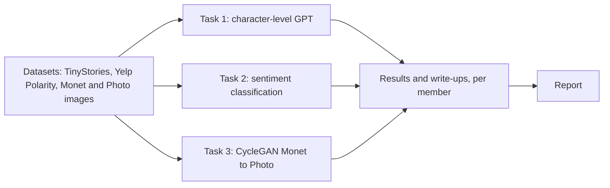

# DATA266 Lab 1: GPT From Scratch, Sentiment Classification, and CycleGAN Style Transfer

**Team:** Manav Patel (`member_manav`) and Pramod Dindukurthi (`Pramod_Dindukurthi`)

## What this repo contains

This repo has 3 tasks for DATA 266 Fall 2026, Lab 1: a character-level GPT trained from scratch, a sentiment classifier compared across 3 models, and a CycleGAN for Monet-photo style transfer. Each team member built and trained their own models separately, in their own folder, under each task. Results and write-ups are kept per member so they can be compared side by side.

## Repo layout

```
task1_llm/
  member_manav/        task1_gpt.ipynb, README.md, results.md, failure_analysis.md, checkpoints/, outputs/
  Pramod_Dindukurthi/   src/ (notebook), results.md, failure_analysis.md, checkpoints/, outputs/
task2_sentiment/
  member_manav/         task2_sentiment.ipynb, README.md, results.md, failure_analysis.md, checkpoints/, outputs/
  Pramod_Dindukurthi/   src/ (notebook + runner script), results.md, failure_analysis.md, checkpoints/, outputs/
task3_gan/
  member_manav/         src/task3_cyclegan.ipynb, README.md, results.md, failure_analysis.md, checkpoints/, outputs/
  Pramod_Dindukurthi/   src/ (notebook), results.md, failure_analysis.md, checkpoints/, outputs/
reproducibility/        raw training logs and run manifests for both members
```

## Project diagram



## The three tasks

### Task 1: character-level GPT on TinyStories

A GPT-style language model, written from scratch (no library attention), trained to predict the next character on the TinyStories dataset.

- Manav: val loss 0.5332, perplexity 1.7044, top-1 accuracy 0.8289, 10,827,379 parameters. Code and results: [`task1_llm/member_manav/`](task1_llm/member_manav/README.md).
- Pramod: val loss 0.6852, perplexity 1.984, top-1 accuracy 0.7813, 3,217,152 parameters. Results: [`task1_llm/Pramod_Dindukurthi/results.md`](task1_llm/Pramod_Dindukurthi/results.md).

### Task 2: sentiment classification on Yelp Polarity

Both members trained 3 models from scratch (no pretrained embeddings) to classify reviews as positive or negative, using the same 200,000-review training pool and the same 38,000-review test set.

- Manav: AvgBaseline / BiLSTM / BiLSTMAttn, accuracy 0.9287 / 0.9426 / 0.9420. Code and results: [`task2_sentiment/member_manav/`](task2_sentiment/member_manav/README.md).
- Pramod: TextCNN / DPCNN / Scratch Transformer Encoder, accuracy 0.934447 / 0.929684 / 0.920105. Results: [`task2_sentiment/Pramod_Dindukurthi/results.md`](task2_sentiment/Pramod_Dindukurthi/results.md).

### Task 3: CycleGAN for Monet and photo translation

A CycleGAN (2 generators, 2 discriminators), trained from scratch, that turns photos into Monet-style paintings and back. The course evaluation script scores it with FID and MiFID averaged over both directions, shown as a negative number, where less negative is better.

- Manav: final official score -49.0330 (FID 97.6555, MiFID 0.41027), 300 images per direction. Code and results: [`task3_gan/member_manav/`](task3_gan/member_manav/README.md).
- Pramod: official score -50.2578 (FID 100.104527, MiFID 0.411176), using the same official protocol (300 images per direction). Results: [`task3_gan/Pramod_Dindukurthi/results.md`](task3_gan/Pramod_Dindukurthi/results.md).

## Results at a glance

**Task 1**

| Metric | Manav Patel | Pramod Dindukurthi |
|---|---|---|
| Train / val stories | 100,000 / 10,000 | 100,000 / 10,000 |
| Val loss | 0.5332 | 0.6852 |
| Perplexity | 1.7044 | 1.984 |
| Top-1 next-char accuracy | 0.8289 | 0.7813 |
| Parameters | 10,827,379 | 3,217,152 |

Note: same dataset split size on both sides, but different model sizes (Manav: 6 layers, 6 heads, 384-dim, 256-character context; Pramod: 4 layers, 8 heads, 256-dim, 128-character context), so this is not a controlled architecture comparison.

**Task 2**

| Metric | Manav (AvgBaseline / BiLSTM / BiLSTMAttn) | Pramod (TextCNN / DPCNN / Transformer) |
|---|---|---|
| Training pool | 200,000 (190K train / 10K val) | 200,000 |
| Test set | 38,000 | 38,000 |
| Accuracy | 0.9287 / 0.9426 / 0.9420 | 0.934447 / 0.929684 / 0.920105 |

Note: same training pool size and same test set size on both sides, but the 3 models are different architectures on each side, so results compare at the task level, not model-for-model.

**Task 3**

| Metric | Manav | Pramod |
|---|---|---|
| Official FID | 97.6555 | 100.104527 |
| Official MiFID | 0.41027 | 0.411176 |
| Score | -49.0330 | -50.2578 |
| Photo-to-Monet predictions scored | 7,038 | 300 |

Note: both FID/MiFID numbers use the course's official protocol (300 images per direction). Manav's B2A (photo-to-Monet) evaluation covers all 7,038 photos; Pramod's covers 300. This is a different evaluation sample size on the two sides, so the two FID/MiFID pairs are not on fully equal footing.

## How to run a quick smoke test

**Setup first:** install `torch` and `torchvision` for your own CUDA version, then run `pip install -r requirements.txt` inside the task folder you want to run. `requirements.txt` exists in `task1_llm/member_manav/`, `task2_sentiment/member_manav/`, and `task3_gan/member_manav/`.

Running these commands overwrites the notebook's saved outputs. Run them on a copy of the repo, or run `git checkout -- <notebook>` afterward to restore the committed version.

Task 1 (Manav):
```powershell
cd task1_llm/member_manav
$env:CONFIG = "local"
..\..\.venv\Scripts\python.exe -m nbconvert --to notebook --execute --inplace --ExecutePreprocessor.timeout=-1 task1_gpt.ipynb
```

Task 2 (Manav):
```powershell
cd task2_sentiment/member_manav
$env:CONFIG = "local"
..\..\.venv\Scripts\python.exe -m nbconvert --to notebook --execute --inplace --ExecutePreprocessor.timeout=-1 task2_sentiment.ipynb
```

Task 3 (Manav):
```powershell
cd task3_gan/member_manav
$env:CONFIG = "local"
..\..\.venv\Scripts\python.exe -m nbconvert --to notebook --execute --inplace --ExecutePreprocessor.timeout=-1 src/task3_cyclegan.ipynb
```

## Model weights

`.gitignore` excludes most `.pt` checkpoint files; only the files below are actually tracked in git.

| Member | Task | Weight files committed |
|---|---|---|
| Manav | Task 1 | `task1_llm/member_manav/checkpoints/manav_task1_weights.pt` |
| Manav | Task 2 | `task2_sentiment/member_manav/checkpoints/manav_task2_baseline_weights.pt`, `manav_task2_bilstm_weights.pt`, `manav_task2_bilstm_attn_weights.pt` |
| Manav | Task 3 | `task3_gan/member_manav/checkpoints/manav_task3_G_A2B.pt`, `manav_task3_G_B2A.pt` |
| Pramod | Task 1 | `task1_llm/Pramod_Dindukurthi/checkpoints/best_model.pt` |
| Pramod | Task 2 | `task2_sentiment/Pramod_Dindukurthi/checkpoints/textcnn/best_full.pt`, `dpcnn/best_full.pt`, `transformer/best_full.pt` |

## Authors

- Manav Patel — `task1_llm/member_manav/`, `task2_sentiment/member_manav/`, `task3_gan/member_manav/`
- Pramod Dindukurthi — `task1_llm/Pramod_Dindukurthi/`, `task2_sentiment/Pramod_Dindukurthi/`, `task3_gan/Pramod_Dindukurthi/`
