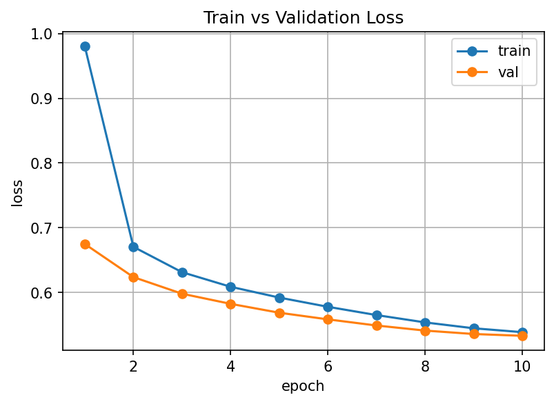

# Task 1 Results: Character-Level GPT on TinyStories

## 1. Goal

I built a small GPT-style language model from scratch, at the character level.
I trained it on TinyStories to see if it can learn to write simple children's stories.

## 2. Data

- Dataset: TinyStories (`roneneldan/TinyStories`)
- Split: 100,000 train stories / 10,000 val stories, picked with a fixed seed (42) so the split is always the same
- Vocab size: 115 characters (built only from the train text)
- Train sequences: 354,329
- Val sequences: 35,407
- Block size: 256 characters (each training example is 256 characters long)
- Input/target shift: for a chunk of text, the input `x` is characters `0..255` and the target `y` is characters `1..256`. So at every position the model tries to predict the next character, one step ahead.

## 3. Architecture

The model is a small GPT, written by hand, not copied from a library:

- Token embedding + positional embedding, added together
- 6 transformer blocks, each with:
  - Pre-LayerNorm, then my own multi-head causal self-attention (6 heads, 384 embedding dim)
  - A residual connection (add the attention output back to the input)
  - Pre-LayerNorm, then a feed-forward network (hidden size is 4x the embedding size, so 1536)
  - Another residual connection
- Final LayerNorm
- LM head: a linear layer that maps back to the 115 character vocabulary

**No `nn.MultiheadAttention`, no `nn.Transformer`/`nn.TransformerEncoder`, and no `torch.nn.functional.scaled_dot_product_attention` were used anywhere.** The attention (including the causal mask) is implemented from scratch with plain `nn.Linear` layers and matrix multiplies.

**Parameter count: 10,827,379** (about 10.8 million)

## 4. Hyperparameters

| Hyperparameter | Value | Why |
|---|---|---|
| Layers (n_layer) | 6 | enough depth to learn simple story patterns without being too slow to train |
| Heads (n_head) | 6 | lets the model look at the sequence from a few different angles at once |
| Embedding size (n_embd) | 384 | small enough to train fast on one GPU, big enough to hold some meaning |
| Block size | 256 | TinyStories sentences are short, so 256 characters is enough context |
| Dropout | 0.1 | small amount of regularization since the dataset is large |
| Batch size | 64 | fits comfortably in GPU memory with room to spare |
| Learning rate | 6e-4 | a common starting point for small transformer models |
| Warmup steps | 1000 | avoids a big, unstable update at the very start of training |
| LR schedule | cosine decay down to 10% of the peak LR | keeps learning fast early and fine-tunes gently near the end |
| Weight decay | 0.1 | light regularization to stop weights from growing too large |
| Grad clip | 1.0 | caps the gradient size so a single bad batch can't blow up training |
| Epochs | 10 | enough passes over the data for the loss to flatten out |
| Precision | bf16 autocast | roughly 2x faster on the RTX 4090 with almost no accuracy loss |

## 5. Hardware and Cost

- GPU: NVIDIA GeForce RTX 4090
- OS: Windows 11
- Total training time: 2718.06 seconds (about 45.3 minutes)
- Train tokens/sec: 344,360
- Generation tokens/sec: 95.75
- Peak memory: 3925.24 MB (about 3.8 GB)

## 6. Results

| Metric | Value | What it means |
|---|---|---|
| Final train loss | 0.5388 | average cross-entropy loss on train data in the last epoch |
| Final val loss | 0.5332 | average cross-entropy loss on held-out val data |
| Perplexity (train) | 1.7140 | how "surprised" the model is by train text, on average (lower is better) |
| Perplexity (val) | 1.7044 | same, but on val text |
| Bits per character (train) | 0.7773 | how many bits it takes the model to encode one train character |
| Bits per character (val) | 0.7692 | same, but for val |
| Generalization gap | -0.0056 | val loss minus train loss; a small negative number means almost no overfitting |
| Top-1 accuracy (val) | 0.8289 | how often the model's single best guess for the next character is correct |
| Distinct-1 | 0.2940 | fraction of unique single characters in generated text (lower is normal for char-level text) |
| Distinct-2 | 0.6764 | fraction of unique 2-character pairs in generated text |
| Distinct-3 | 0.8231 | fraction of unique 3-character sequences in generated text |
| Repeated 4-gram rate | 0.1270 | how often a 4-character chunk repeats in generated text |
| Mean grad norm | 0.2253 | average size of the gradient during training |
| Max grad norm | 10.0361 | largest gradient size seen (before clipping) |
| Grad spikes | 0 | number of gradient spikes (none happened) |
| NaN count | 0 | number of NaN losses (none happened) |
| Parameter count | 10,827,379 | total trainable weights in the model |
| Train tokens/sec | 344,360.17 | training throughput |
| Generation tokens/sec | 95.75 | generation throughput |
| Peak memory (MB) | 3925.24 | highest GPU memory used during training |
| Total training time (s) | 2718.06 | wall-clock training time |

## 7. Notes

- **Val loss is slightly lower than the epoch-average train loss.** This looks backwards at first, but it makes sense: the train loss for an epoch is averaged over the *whole* epoch, including the early steps when the model is still learning and the weights are not yet near their best value. Dropout is also on during training (not during val), which adds extra noise to the train loss. The val loss is measured once, at the end of the epoch, with the model's current (better) weights and no dropout.
- **Max grad norm (10.04) happened in the very first epoch.** Looking at `history.csv`, the largest gradient (10.0361) came from epoch 1, when the model's weights are still random and the first updates are the roughest. Gradient clipping caught this, and there were 0 grad spikes and 0 NaNs during the whole run, so training stayed stable.
- **Generation is slow (about 96 tokens/sec)** compared to training (about 344,000 tokens/sec). This is expected: generation makes one character at a time, one at a time, with batch size 1, and recomputes the full forward pass each step because there is no KV cache to reuse past computations.

## 8. Strengths, Limitations, Future Work

**Strengths**
- Trains fast and stably: 0 NaNs, 0 grad spikes over 10 full epochs.
- Low val loss and high top-1 next-character accuracy (82.9%) for a model this small.
- Small generalization gap, so the model is not overfitting the train set.

**Limitations**
- Character-level modeling means short context (256 characters) covers only a sentence or two, so the model can lose track of who a story is about.
- Greedy decoding can get stuck in loops (see `failure_analysis.md`).
- Generation is slow because it is not batched and has no KV cache.

**Future Work**
- Add a KV cache so generation does not recompute everything at every step.
- Add top-k / top-p sampling or a repetition penalty to reduce loops in generated text.
- Try a longer block size so the model can remember more of the story.
