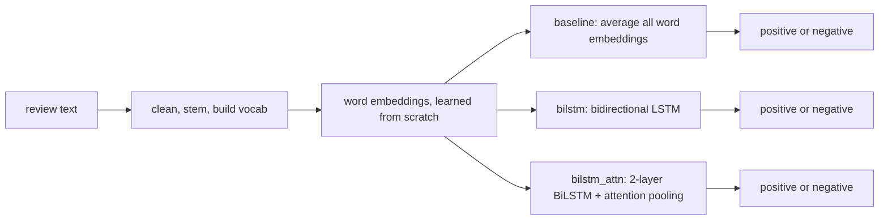

# Task 2: Sentiment Classification on Yelp Polarity

Task 2 asks us to classify Yelp reviews as positive or negative, and compare a few models of different complexity. I built 3 models that all learn their own word embeddings from scratch, with no pretrained vectors or language models anywhere: a simple averaging baseline, a bidirectional LSTM, and a BiLSTM with attention. I trained and tested all 3 on the same cleaned data so the comparison is fair, and looked closely at where each one makes mistakes. This file explains the data, the 3 models, what I tried, and how to run it.

## Result

Test set results for all 3 models (38,000 reviews):

| Metric | baseline | bilstm | bilstm_attn |
|---|---|---|---|
| Accuracy | 0.9287 | **0.9426** | 0.9420 |
| F1 (macro) | 0.9287 | **0.9426** | 0.9420 |
| ROC-AUC | 0.9771 | 0.9862 | **0.9866** |
| MCC | 0.8574 | **0.8853** | 0.8841 |

**bilstm was the best model overall**, narrowly ahead of bilstm_attn (their accuracy confidence intervals overlap almost completely, so attention did not give a reliable extra gain here) and clearly ahead of the baseline (confirmed with McNemar's test, p ≈ 1.98e-33). The baseline, despite lower accuracy, was the best-calibrated model (ECE 0.0087 vs 0.0184 for both LSTMs).

## How it works



- **baseline** (`src/models.py`, `AvgBaseline`): averages every word's embedding in the review, then a classifier on top. No sense of word order, just "which words are present."
- **bilstm** (`BiLSTM`): a bidirectional LSTM reads the review left-to-right and right-to-left, so word order matters ("not good" and "good not" are different inputs).
- **bilstm_attn** (`BiLSTMAttn`): a 2-layer BiLSTM plus attention pooling, so the model can learn to focus more on the words that matter most for sentiment instead of averaging every word equally.
- **All 3 models use `embed_dim: 128`** so the comparison is about architecture, not embedding size, and all learn their embeddings from a plain `nn.Embedding` layer, not pretrained vectors.
- **Preprocessing**: lowercase, decode unicode escapes, remove URLs/HTML, remove punctuation, remove stopwords (but keep negation words like "no", "not", "n't"), Porter stemming, then a 30,000-word vocabulary built only from the train set (`min_freq: 2`).

## What I did, step by step

| Step | What changed | Result |
|---|---|---|
| Data cleaning, vocab, loaders | built the Yelp cleaning pipeline and word-level vocab | — |
| 3 models | wrote `AvgBaseline`, `BiLSTM`, `BiLSTMAttn` from scratch | — |
| Training loop | added LR warmup, checkpoints, resume support | — |
| Test evaluation + comparison | added full test metrics and model-vs-model comparison | — |
| Escaped-unicode fix | some review text had raw unicode escape sequences left in it after loading | 302,789 train rows and 20,464 test rows decoded back to normal text instead of being left broken |
| 200K training subset | switched the GPU run to a 200,000-review seeded sample (190K train / 10K val) instead of the full train set | "enough data for a word-level model, fast enough to run 3 models on a GPU" (`results.md`) |
| pyarrow speed-up | sped up data loading | — |
| `torch.load` fix | same newer-torch issue as Task 1 | checkpoint loading works again |
| Error review | added a 20-row manual error review on the test set | became `failure_analysis.md` |

Early stopping: training uses `patience: 2` (see `configs/gpu.yaml`) out of 5 max epochs, stopping early if val performance stops improving.

## Problems I found and fixed

- **Escaped unicode characters were left broken in the review text** (for example `é` showing up as the literal escape code instead of the real character). Fixed by decoding unicode escapes during cleaning, for 302,789 train rows and 20,464 test rows.
- **15 train reviews became empty after cleaning** and were dropped (0 in val/test).
- **`torch.load` broke on a newer torch version**, same root cause as Task 1 — fixed by adding `weights_only=False` in `src/utils.py`.
- **Attention did not reliably beat the plain BiLSTM**, despite costing about 2.6x more training time (380.22s vs 147.50s). Not a bug, but a real, documented negative result (see `results.md` section 6).

## Folder map

| Path | What it is |
|---|---|
| `configs/local.yaml`, `configs/gpu.yaml` | smoke-test and full-run settings for all 3 models |
| `src/models.py` | `AvgBaseline`, `BiLSTM`, `BiLSTMAttn`, written from scratch |
| `src/data.py` | Yelp loading, cleaning, vocab, data loaders |
| `src/utils.py` | checkpoint save/load, logger, device helpers |
| `task2_sentiment.ipynb` | the one notebook that trains, tests, and compares all 3 models |
| `checkpoints/manav_task2_baseline_weights.pt`, `_bilstm_weights.pt`, `_bilstm_attn_weights.pt` | the 3 trained models |
| `outputs/gpu/error_review.csv` | the 20 manually reviewed test errors behind `failure_analysis.md` |
| `results.md` | the full write-up: data, preprocessing, all 3 models' metrics |
| `failure_analysis.md` | 20 real misclassified reviews, grouped by error type |

## How to run

**(a) Quick smoke test** (5,000 train reviews, 1 epoch):
```powershell
cd task2_sentiment/member_manav
$env:CONFIG = "local"
..\..\.venv\Scripts\python.exe -m nbconvert --to notebook --execute --inplace --ExecutePreprocessor.timeout=-1 task2_sentiment.ipynb
```

**(b) Full training (all 3 models):**
```powershell
cd task2_sentiment/member_manav
$env:CONFIG = "gpu"
..\..\.venv\Scripts\python.exe -m nbconvert --to notebook --execute --inplace --ExecutePreprocessor.timeout=-1 task2_sentiment.ipynb
```

**(c) Evaluation:** there is no separate evaluation script — `task2_sentiment.ipynb` runs the test-set evaluation and 3-model comparison as part of the same run shown above.

## Rules I followed

- All 3 models learn their own word embeddings from scratch (`nn.Embedding`); no pretrained vectors (GloVe, word2vec) and no pretrained language model are used anywhere.
- The vocabulary is built only from the train split, never from val or test.
- A fixed seed (42) is set for the data split and training.
