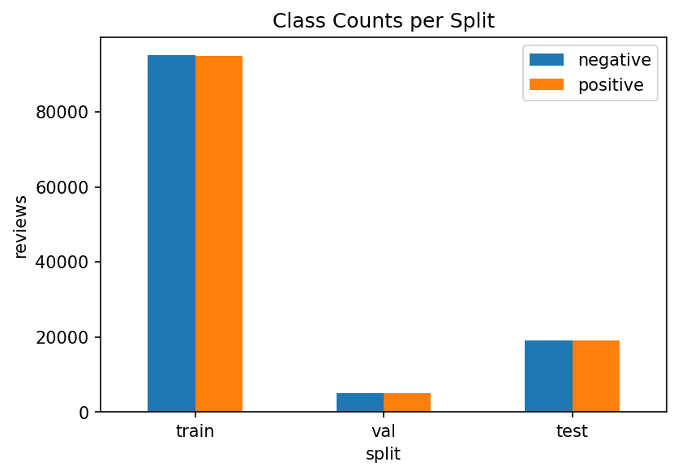
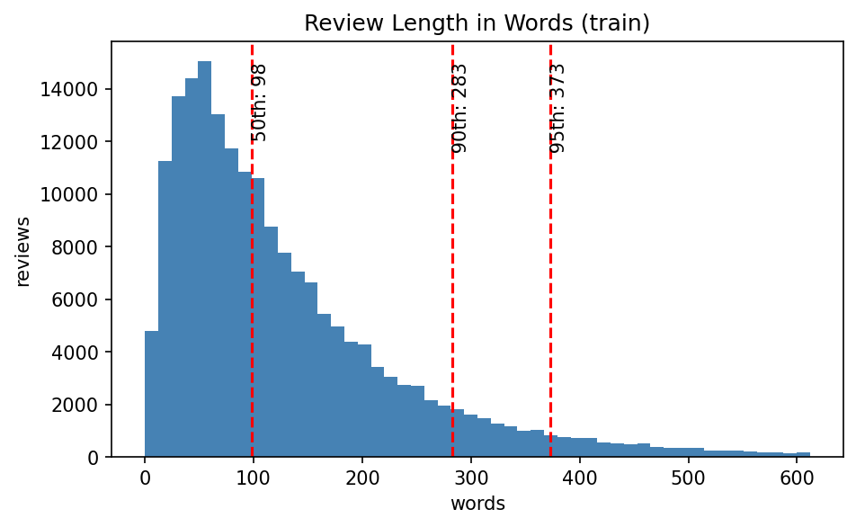
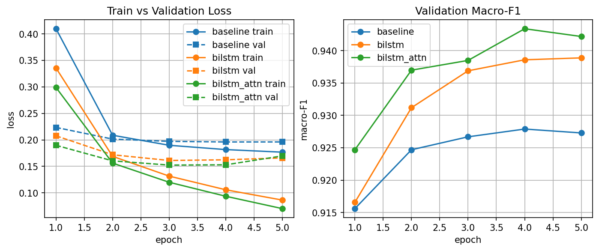

# Task 2 Results: Sentiment Classification on Yelp Polarity

## 1. Goal and Data

**Goal:** classify Yelp reviews as positive or negative, using 3 models of increasing complexity, and compare them.

**Data:** Yelp Polarity (`fancyzhx/yelp_polarity`), a 200K seeded sample for train/val, plus the full 38K test set.

| Split | Reviews | Negative | Positive |
|---|---|---|---|
| Train | 190,000 | 95,120 | 94,880 |
| Val | 10,000 | 5,016 | 4,984 |
| Test | 38,000 | 19,000 | 19,000 |

The class balance is almost exactly 50/50 in every split (see `class_balance.png`), so accuracy is a fair metric here — there is no majority-class shortcut.

Review length (from `length_distribution.png`): most reviews are short to medium, with a long tail of longer reviews. With `max_len` set to 256 words, only about **2%** of reviews get cut (2.05% train, 1.94% val, 2.04% test), so almost every review fits in full.

Malformed/escaped rows were handled during loading: 15 train reviews were dropped for being empty after cleaning (0 in val/test). Separately, a lot of rows had escaped characters that needed decoding: 302,789 train rows and 20,464 test rows had escape sequences (like `\n` or `é`), and 12,521 train / 879 test rows had unicode escapes specifically. These were decoded back to normal text, not dropped.

## 2. Preprocessing

Each review goes through the same cleaning steps before modeling:

1. **Lowercase** everything.
2. **Decode unicode escapes** (turn `é` back into `é`, etc.) so no review is left with raw escape codes.
3. **Remove URLs and HTML** tags/entities.
4. **Remove punctuation** (keep only letters, digits, and spaces).
5. **Remove stopwords, but keep negation words** (like "no", "not", "n't"). Normal stopword lists usually throw these away, but for sentiment, "not good" and "good" are opposite meanings. Keeping negation words lets the model actually see when a sentence is being flipped.
6. **Porter stemming** on every remaining word (so "loved", "loving", "loves" all become "love").
7. **Build a word-level vocabulary from the train set only**, capped at 30,000 words, keeping only words that appear at least 2 times (`min_freq: 2`). This avoids learning the val/test vocabulary and avoids wasting vocab slots on one-off typos.
8. **max_len = 256 words** per review, as noted above this only cuts about 2% of reviews.

## 3. The 3 Models

All 3 models learn their own word embeddings from scratch with a plain `nn.Embedding` layer. No pretrained vectors (GloVe, word2vec, etc.) and no pretrained language models were used anywhere. This keeps the comparison fair: any difference between the 3 models comes from their own architecture, not from outside knowledge baked into pretrained embeddings.

| Model | Idea | Why |
|---|---|---|
| **baseline** | average all word embeddings in the review, then a classifier on top | simplest possible model — no sense of word order, just "which words are present" |
| **bilstm** | a bidirectional LSTM reads the review left-to-right and right-to-left | adds word order — "not good" and "good not" are no longer the same input |
| **bilstm_attn** | 2-layer BiLSTM + attention pooling | lets the model learn to focus more on the words that matter most for sentiment, instead of averaging every word equally |

### Hyperparameters

| Hyperparameter | Value | Why |
|---|---|---|
| Train samples | 200,000 (190K/10K split) | enough data for a word-level model, fast enough to run 3 models on a GPU |
| max_len | 256 words | covers about 98% of reviews without being wastefully long |
| max_vocab | 30,000 words | big enough to cover almost all common words, small enough to keep the embedding table manageable |
| min_freq | 2 | drops words that appear once, which are usually typos or very rare |
| Epochs | 5 (with patience 2) | sentiment on this much data converges fast; patience 2 stops early if val stops improving |
| Batch size | 256 | big enough for a stable gradient estimate, fits easily in GPU memory |
| Weight decay | 0.01 | light regularization against overfitting |
| Grad clip | 1.0 | stops a single bad batch from causing a huge update |
| Warmup ratio | 0.1 | ramps the learning rate up gently for the first 10% of steps |
| embed_dim | 128 (all models) | same embedding size everywhere, so the comparison is about architecture, not embedding size |
| baseline dropout / lr | 0.2 / 2e-3 | simple model can use a higher learning rate and less dropout since it has fewer parameters to overfit with |
| bilstm hidden / layers / dropout / lr | 128 / 1 / 0.3 / 1e-3 | one LSTM layer is enough to pick up word order; lower lr and more dropout than baseline since it's a bigger model |
| bilstm_attn hidden / layers / dropout / lr | 128 / 2 / 0.3 / 1e-3 | 2 stacked LSTM layers give the attention layer richer features to choose from |

## 4. Hardware and Cost (RTX 4090)

| Model | Parameters | Training time (s) | Examples/sec | Peak memory (MB) |
|---|---|---|---|---|
| baseline | 3,840,129 | 9.46 | 103,107 | 139.51 |
| bilstm | 4,104,449 | 147.50 | 6,570 | 364.17 |
| bilstm_attn | 4,499,970 | 380.22 | 2,533 | 520.45 |

The baseline is extremely fast (under 10 seconds total) since it has no recurrence. The BiLSTM is much slower because an LSTM has to process the sequence one word at a time. The attention model is slower still, mostly because it has 2 LSTM layers instead of 1.

## 5. Test Results (all 3 models)

| Metric | baseline | bilstm | bilstm_attn |
|---|---|---|---|
| Accuracy | 0.9287 | 0.9426 | 0.9420 |
| Precision (macro) | 0.9287 | 0.9426 | 0.9421 |
| Recall (macro) | 0.9287 | 0.9426 | 0.9420 |
| F1 (macro) | 0.9287 | 0.9426 | 0.9420 |
| Precision (micro) | 0.9287 | 0.9426 | 0.9420 |
| Recall (micro) | 0.9287 | 0.9426 | 0.9420 |
| F1 (micro) | 0.9287 | 0.9426 | 0.9420 |
| Precision (weighted) | 0.9287 | 0.9426 | 0.9421 |
| Recall (weighted) | 0.9287 | 0.9426 | 0.9420 |
| F1 (weighted) | 0.9287 | 0.9426 | 0.9420 |
| ROC-AUC | 0.9771 | 0.9862 | 0.9866 |
| PR-AUC | 0.9770 | 0.9867 | 0.9870 |
| MCC | 0.8574 | 0.8853 | 0.8841 |
| Brier score | 0.0540 | 0.0437 | 0.0439 |
| ECE | 0.0087 | 0.0184 | 0.0184 |
| Accuracy 95% CI | [0.9262, 0.9313] | [0.9401, 0.9450] | [0.9397, 0.9443] |
| Macro-F1 95% CI | [0.9262, 0.9313] | [0.9401, 0.9450] | [0.9397, 0.9442] |
| MCC 95% CI | [0.8525, 0.8626] | [0.8803, 0.8901] | [0.8794, 0.8885] |
| McNemar vs baseline (p-value) | — | 1.98e-33 | 2.89e-29 |

Confusion matrix counts (tn, fp, fn, tp):

| Model | TN | FP | FN | TP |
|---|---|---|---|---|
| baseline | 17,689 | 1,311 | 1,399 | 17,601 |
| bilstm | 17,971 | 1,029 | 1,151 | 17,849 |
| bilstm_attn | 17,971 | 1,029 | 1,174 | 17,826 |

(See per-model `confusion_matrix.png` and `reliability.png` for the plots.)

### Per-slice macro-F1 and error rate

| Slice | baseline F1 / error | bilstm F1 / error | bilstm_attn F1 / error |
|---|---|---|---|
| short | 0.9248 / 7.21% | 0.9385 / 5.90% | 0.9355 / 6.19% |
| medium | 0.9277 / 7.23% | 0.9440 / 5.60% | 0.9423 / 5.77% |
| long | 0.9278 / 6.77% | 0.9369 / 5.92% | 0.9421 / 5.42% |
| has_negation | 0.9208 / 7.64% | 0.9396 / 5.82% | 0.9398 / 5.80% |
| has_contrast | 0.9189 / 8.01% | 0.9351 / 6.41% | 0.9357 / 6.35% |

## 6. Comparing the 3 Models (in simple words)

- **Both LSTMs beat the baseline by a lot, and it is not noise.** McNemar's test gives p ≈ 1.98e-33 (bilstm vs baseline) and p ≈ 2.89e-29 (bilstm_attn vs baseline). Both are far below any normal significance cutoff, so word order really does matter for this task.
- **bilstm (0.9426) and bilstm_attn (0.9420) are basically tied.** Their accuracy 95% CIs overlap almost completely ([0.9401, 0.9450] vs [0.9397, 0.9443]), so attention did not give a reliable gain here, even though it costs about **2.6x more training time** (380.22s vs 147.50s).
- **The baseline is the best calibrated model.** Its ECE is 0.0087, versus 0.0184 for both LSTMs — about half as much calibration error. The LSTMs are more overconfident. This matches their training curves: both LSTMs' val loss actually goes back up in the last epoch (bilstm: 0.1624 → 0.1660, bilstm_attn: 0.1530 → 0.1698), which is a sign of mild overfitting, even though val accuracy still looks fine.
- **On slices:** the baseline is weakest on `has_contrast` (F1 0.9189) and `has_negation` (F1 0.9208) reviews — these are the hardest cases for a model that just averages word embeddings with no order. The LSTMs fix most of that gap. Attention helps the most specifically on **long reviews** (bilstm_attn 0.9421 vs bilstm 0.9369), which makes sense: attention should help most when there is more text to sift through for the important words.
- **Errors are fairly balanced between false positives and false negatives** for all 3 models (baseline: 1311 FP vs 1399 FN; bilstm: 1029 FP vs 1151 FN; bilstm_attn: 1029 FP vs 1174 FN) — no model is strongly biased toward one kind of mistake.

## 7. Strengths, Limitations, Future Work

**Strengths**
- All 3 models train fast and reach over 92% accuracy with embeddings learned from scratch, no outside data.
- The gap between baseline and the LSTMs is large and statistically confirmed (McNemar), so the value of word order is clearly shown, not just assumed.
- Slice-level and calibration metrics give a fuller picture than accuracy alone.

**Limitations**
- Attention did not clearly beat the plain BiLSTM here, despite costing much more to train.
- All models struggle more on negation and contrast reviews than on plain reviews.
- The LSTMs are less well-calibrated than the baseline, so their confidence scores should not be fully trusted as real probabilities.

**Future Work**
- Look closer at the 20 reviewed errors (see `failure_analysis.md`) to find a concrete fix for contrast/negation cases.
- Try early stopping right at the best val epoch (not just patience-based) to reduce the last-epoch overfitting seen in both LSTMs.
- Try a small pretrained embedding (as a separate experiment, not for grading this lab) to see how much headroom is left.
