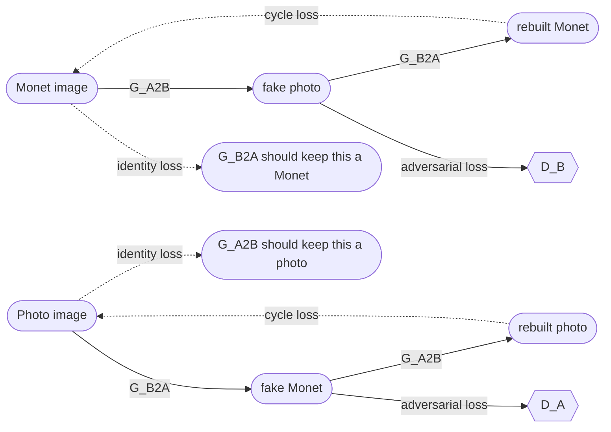

# Task 3: Monet ↔ Photo CycleGAN

Task 3 asks us to turn photos into Monet-style paintings, and Monet paintings into photo-style images, without any paired examples. I built and trained a CycleGAN from scratch to do this: two generators and two discriminators, no pretrained network anywhere in the training loss. I trained it in one long line of resumed runs, tried a few side ideas that did not help, and ended with an average of several EMA checkpoints from the end of training. This file explains what the project does, how the model works, what I tried, and how to run it.

## 1. Result (latest score only)

Measured with the professor's official evaluation script, 300 images per direction:

| Metric | Value |
|---|---|
| FID | 97.6555 |
| MiFID | 0.41027 |
| Score | **-49.0330** |

The final range of checkpoints was chosen using the same 300 photos the official script itself reads, so this score is a little optimistic.

## Scores

`outputs/final/score_history.csv` has one row per run, in `run, steps, what_changed, scorer, a2b_fid, b2a_fid, mifid, score, kaggle_ref` order. A few notes on reading it, since a csv file cannot hold a header note row:

- **score** is always written as a positive number, where lower is better (this is the same as (FID + MiFID) / 2). The official Kaggle score is just this number with a minus sign in front of it.
- **scorer** says whether the row's numbers came from the professor's official script, or from our own quick scorer (built the same way, same 300 images, just not uploaded to Kaggle on its own).
- **a2b_fid** and **b2a_fid** are filled in only where the source file actually splits them out by direction. The official script's own csv only reports one combined FID and one combined MiFID, so most official-script rows leave these two cells empty. Where a direction split exists (from `outputs/diagnostics.csv`, or from re-scoring the exact same averaged weights with our own quick scorer), it is filled in even on an official-script row, since it is the same model either way.
- **mifid** is always the single combined MiFID value for that row.
- **kaggle_ref** is the Kaggle submission reference number, left empty for runs that were never submitted on their own (most of the quick-scorer-only rows, and the one official re-measure of the 100K model that was never re-uploaded under its official-script number).
- The **baseline** row's scorer is marked "unknown (early submission)" because this project's own evaluation code did not exist yet when it was submitted, so there is no local record of how its score was computed.

`outputs/final/submission.csv` is an exact copy of `outputs/gpu_final_swa/official_submission.csv`, the one file actually submitted to Kaggle.

## 2. How the model works



Domain A is the Monet paintings, domain B is the photos (checked in `src/data.py`, where the real Monet batch is called `real_a` and the real photo batch is called `real_b`). `G_A2B` turns Monet into photo-style, `G_B2A` turns photo into Monet-style. `D_A` judges Monet images, `D_B` judges photo images.

- **Generator**: a ResNet with 9 residual blocks (`src/models.py`, `ResNetGenerator`, `n_res_blocks=9`). It takes an image in one domain and outputs an image the same size in the other domain.
- **Discriminator**: a 70x70 PatchGAN (`src/models.py`, `PatchDiscriminator`). Instead of judging the whole image at once, it looks at small patches and says if each patch looks real or fake.
- **The three losses**: adversarial loss pushes the generators to fool the discriminators; cycle loss pushes "translate, then translate back" to give back the original image; identity loss pushes a generator to leave an image alone if it is already in its own target domain.
- **Image pool of 50**: the discriminators see a mix of 50 recent fake images, not just the newest one, which keeps training more stable.
- **DiffAugment and EMA weights**: DiffAugment applies the same small random change (color, translation, cutout) to real and fake images before the discriminator sees them, so it cannot just memorize the 300 real Monet images. EMA keeps a slow-moving average of the generator weights, which gives smoother, less noisy results than the raw training weights, and is what every prediction in this project is made from.

## 3. What I did, step by step

| Run | What changed | Score |
|---|---|---|
| 100K run | identity weight 5, cycle weight 10, trained from scratch | official **-53.92** |
| ft_id1 | identity weight 5 → 1, cycle weight stays 10 | official **-52.94** |
| ft_c5 | cycle weight 10 → 5, identity weight → 0 | official **-52.02** |
| ft_c25 (160K) | cycle weight 5 → 2.5 | quick scorer **51.07** |
| ft_c1 (180K) | cycle weight 2.5 → 1.0 | quick scorer **50.86** |
| avg5 | average of ft_c25 (160K) and ft_c1 (165K–180K), 5 EMA files | official **-50.58** |
| **swa final** | constant learning rate, then average of 6 EMA files (216,000–226,000) | official **-49.03** |

Two more ideas were tried and did not help, so they were dropped:

- **id05_sn**: fresh run with a spectral-norm discriminator. Score **55.72**, stopped early.
- **arch2**: fresh run with resize-based upsampling and a 2-scale discriminator. Score **65.31**, not better, stopped early.

**What worked:**
- Lowering the cycle weight step by step, from 10 to 5 to 2.5 to 1.0. Going lower, to 0.5, made the score worse, so 1.0 was kept.
- Restarting the learning rate at each new stage, while always keeping the saved optimizer state when resuming, which kept training stable.
- A long constant learning-rate phase of 5e-5, from step 180,000 to step 226,000, instead of decaying the learning rate to zero.
- Averaging the EMA weights from 6 checkpoints saved every 2,000 steps, from step 216,000 to step 226,000, which beat every single checkpoint on its own.

## 4. The learning rate bug I found

Resuming a run from a saved checkpoint had a bug: it restored the old base learning rate of 2e-4 instead of the new, lower rate set in that run's config. I fixed it by resetting the scheduler's `base_lrs` to the config's learning rate right after loading the checkpoint. After the fix, every resume used the correct, intended learning rate.

## 5. About the scores

My first early number, -44.37, was computed with my own Inception setup on the full image sets, not the professor's method, so it is **not comparable** to anything else in this project. The professor's official script gives **-53.92** for that exact same 100K model. Every other score in this README, and in `results.md`, uses the professor's official script (or a quick scorer built the same way).

## 6. Folder map

| Path | What it is |
|---|---|
| `configs/` | one YAML file per training run (learning rate, loss weights, steps) |
| `src/` | model code (`models.py`, `data.py`, `diffaug.py`, `utils.py`) and the training notebooks |
| `evaluate_local.py` | scoring code, including the official-method quick scorer used during training |
| `official_eval_final_swa.ipynb` | the professor's evaluation script, copied path-only, run on the final model |
| `average_ema.py` | averages EMA weights over a step range and prints the official score |
| `diagnostics.py` | compares and averages checkpoints across runs |
| `outputs/gpu_final_swa/` | the final model's predictions (`pred_A2B`, `pred_B2A`) and its official score file |
| `checkpoints/manav_task3_G_A2B.pt`, `manav_task3_G_B2A.pt` | the final submitted generator weights |
| `results.md` | the full write-up: architecture, training history, metrics, integrity statement |
| `failure_analysis.md` | 5 real failure cases from the final model, with likely causes and fixes |

## 7. How to run

**(a) Quick smoke test** (tiny images, 20 Monet, 20 photos, 300 steps, checks the code runs):
```powershell
cd task3_gan/member_manav
$env:CONFIG = "local"
..\..\.venv\Scripts\python.exe -m nbconvert --to notebook --execute --inplace --ExecutePreprocessor.timeout=-1 src/task3_cyclegan.ipynb
```

**(b) Training** (any config in `configs/`, for example continuing the final model's line):
```powershell
cd task3_gan/member_manav
$env:CONFIG = "gpu_swa_a2"
..\..\.venv\Scripts\python.exe -m nbconvert --to notebook --execute --inplace --ExecutePreprocessor.timeout=-1 src/task3_cyclegan_swa_a2.ipynb
```

**(c) Generating predictions from the final weights:**
```powershell
cd task3_gan/member_manav
..\..\.venv\Scripts\python.exe build_final_model.py outputs/gpu_final_swa 215000 226000
```
This averages the EMA files from the `swa_a`/`swa_a2` checkpoint folders (215,000 to 226,000 by default), saves `G_A2B_swa.pt`/`G_B2A_swa.pt`, writes all 300 + 7,038 predictions, and prints the official quick score.

**(d) Scoring with the official script:**
```powershell
cd task3_gan/member_manav
..\..\.venv\Scripts\python.exe -m nbconvert --to notebook --execute --inplace official_eval_final_swa.ipynb
```

## 8. Rules I followed

- Both generators and both discriminators are trained entirely from scratch.
- No pretrained network, and no Inception features, are used in any training loss.
- No prediction image was hand-picked, hand-edited, or swapped in from anywhere else.
- Every submitted prediction comes from the averaged EMA weights described in section 3.
- The human audit with my partner is still pending.

## 9. Notes

- The `swa_a2` notebook was stopped by hand before it finished, so its record is `outputs/gpu_swa_a2/train_log.txt`, covering steps 220,000 to 226,000.
- Predictions and checkpoints are not stored in git, except the two final weight files, `checkpoints/manav_task3_G_A2B.pt` and `manav_task3_G_B2A.pt`.
