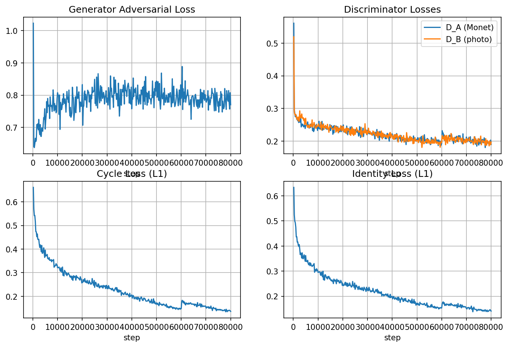
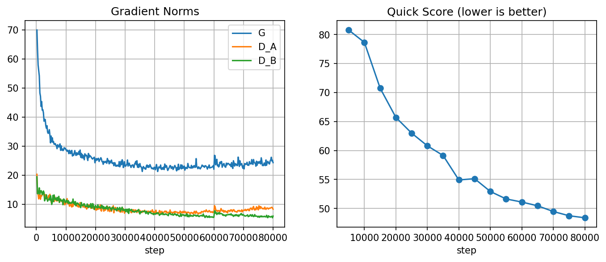
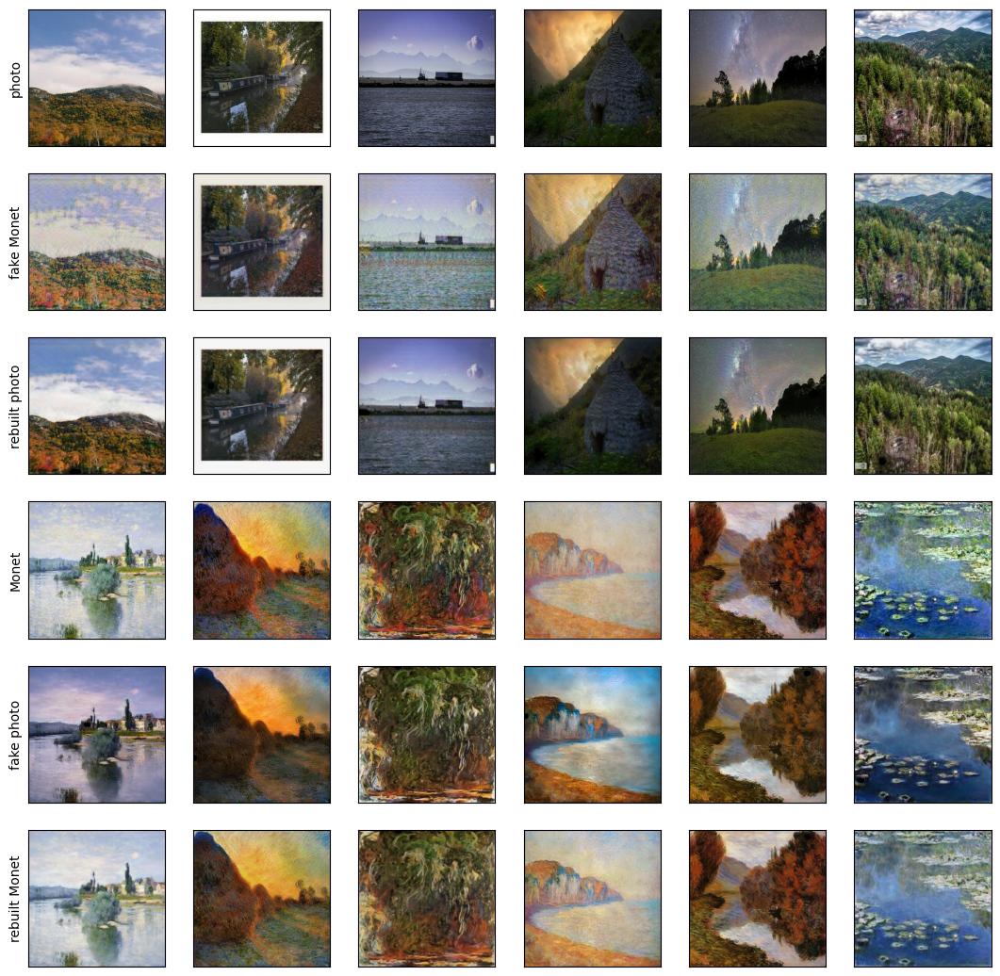

# Task 3 Results: Monet ↔ Photo CycleGAN

## 1. Goal and Data

**Goal:** translate photos into Monet-style paintings and back, without paired examples, using CycleGAN. This is for the Kaggle class competition "DATA 266 Fall 2026 - GAN Image Style Transfer".

**Data:**
- Domain A (Monet paintings): **300 images**
- Domain B (photos): **7,038 images**
- The host confirmed there is no held-out split for this competition — the full 300 and 7,038 images are used for training and also for generating the submission.
- This means domain A is much smaller than domain B (about 23x fewer images). The model sees many more real photos than real Monet paintings, which matters for training tricks (see section 3).

## 2. Architecture

- **2 generators**, both `ResNetGenerator`: 9 residual blocks, instance norm, reflection padding. `G_A2B` turns Monet into photo-style, `G_B2A` turns photo into Monet-style.
- **2 discriminators**, both `PatchDiscriminator`, 70x70 PatchGAN (judges local patches of the image as real/fake instead of the whole image at once). `D_A` judges Monet images, `D_B` judges photo images.

| Network | Job | Parameters |
|---|---|---|
| G_A2B | turns Monet into photo | 11,378,179 |
| G_B2A | turns photo into Monet | 11,378,179 |
| D_A | judges Monet images | 2,764,737 |
| D_B | judges photo images | 2,764,737 |
| **Total** | | **28,285,832** |

**Losses:**
- LSGAN adversarial loss (least-squares GAN loss, more stable than the original GAN loss)
- Cycle consistency loss (L1), weight `lambda_cycle = 10`
- Identity loss (L1), weight `lambda_identity = 5`

## 3. Training Tricks

| Trick | Reason |
|---|---|
| DiffAugment (color, translation, cutout) | with only 300 real Monet images, the discriminator can otherwise just memorize them instead of learning the real style; differentiable augmentation makes that much harder |
| Image pool (size 50) | discriminator sees a mix of recent fakes, not just the newest one, which keeps training more stable |
| Random crop (286 → 256) + horizontal flip | cheap data augmentation so the model doesn't see the exact same crop/orientation every epoch |
| EMA generators (decay 0.999) | the EMA (slow-moving average) weights are smoother than the raw training weights and give better, less noisy samples at eval/submission time |
| Adam, lr 2e-4, linear decay | a standard, well-tested setting for CycleGAN; decaying the LR in the second half of training lets the model settle down instead of oscillating forever |
| Checkpoint chosen by local FID/MiFID score | picks the checkpoint that scores best on the same kind of metric Kaggle uses, not just "looks nice" on a few images |

## 4. Training History

Training happened in 3 stages, each one picking up from the last checkpoint:

1. **0 → 60,000 steps** (first run).
2. **60,000 → 80,000 steps** (extended, because the quick score was still clearly improving at 60K, not flattening out).
3. **80,000 → 100,000 steps** (extended again, same reason — still improving at 80K).

Each extension changed `gpu.yaml` to a new `total_steps` and `decay_start`, so the learning rate schedule restarted (a "smooth restart", not a jump): right after each resume the LR goes from near-zero back up toward the original `2e-4` before decaying again. This caused a small, temporary bump in the loss curves at step 60,000 and 80,000 (see section 8), which recovered within a few hundred steps each time.

**Quick score at each checkpoint** (local proxy score, computed every 5,000 steps, lower is better):

| Step | Quick score |
|---|---|
| 5,000 | 80.78 |
| 20,000 | 65.71 |
| 40,000 | 54.92 |
| 60,000 | 51.10 |
| 70,000 | 49.48 |
| 80,000 | 48.39 |
| 90,000 | 47.86 |
| 100,000 | **47.21** |

**Full overall score (FID + MiFID averaged) at each stage's best checkpoint:**

| Stage | Overall FID | Overall MiFID | Overall score |
|---|---|---|---|
| 60K | 96.3556 | 0.4197 | 48.3876 |
| 80K | 90.8055 | 0.4175 | 45.6115 |
| 100K | **88.3184** | **0.4158** | **44.3671** |

**Winning checkpoint: step 100,000.**

The checkpoint at every stage was chosen by comparing the full score (FID+MiFID) of the 3 most recent checkpoints with the best local quick scores — never by eyeballing individual output images. See `checkpoint_choice.csv` for the exact comparison at each stage.

## 5. Hardware and Cost

- GPU: NVIDIA GeForce RTX 4090
- Total training time across all 3 stages: **8,660.44 seconds (about 2.4 hours / 144.3 minutes)**
- Average images/sec: **23.35**
- Peak memory: **10,946 MB (about 10.7 GB)**

## 6. Final Metrics (both directions, step 100,000)

| Metric | A2B (Monet→photo) | B2A (photo→Monet) | Overall | What it means |
|---|---|---|---|---|
| FID | 88.4422 | 88.1945 | 88.3184 | how different the generated images' features are from real images, on average (lower = more realistic) |
| MiFID | 0.4178 | 0.4137 | 0.4158 | FID combined with a memorization penalty (checks the model isn't just copying training images) |
| Score | 44.4300 | 44.3041 | 44.3671 | (FID + MiFID) / 2, the Kaggle leaderboard metric |
| KID (mean) | 0.0243 | 0.0141 | 0.0192 | a second distribution-distance metric, less biased by sample size than FID |
| Precision | 0.5733 | 0.3867 | 0.4800 | how many generated images actually look like real images in that domain |
| Recall | 0.3000 | 0.6000 | 0.4500 | how much of the real images' variety the generated images cover |
| LPIPS | 0.2686 | 0.3690 | 0.3188 | perceptual distance between input and translated image (lower = closer-looking) |
| Content cosine | 0.8374 | 0.7799 | 0.8086 | how similar the translated image's content features are to the original (higher = content preserved better) |
| Cycle L1 | 0.0741 | 0.0916 | 0.0828 | pixel difference between an image and itself after translating there and back |

## 7. Evaluation Method

Evaluation uses my own `evaluate_local.py`, written to follow the method described on the Kaggle competition's Evaluation page:

- **FID** is computed on the full sets in each direction (all 300 Monet vs. all 7,038 generated-Monet, and all 7,038 photo vs. all 300 generated-photo).
- **MiFID** is the average cosine distance between matched real/fake feature pairs, after subsampling both sets down to the same size (so the comparison is on equal footing).
- **Score** = (FID + MiFID) / 2, in both directions, then averaged for the overall score.

Pretrained models (Inception-v3 for FID/KID features, AlexNet for LPIPS) are used **only to measure** the generated images. They are never used to make or alter any image — the actual training and generation pipeline (`src/models.py`, the training loop) uses only the from-scratch `ResNetGenerator`/`PatchDiscriminator` networks.

## 8. Training Stability

- **0 NaN losses over all 100,000 steps.**
- **Discriminators stayed balanced**, both settling and staying in roughly the **0.19–0.25** range for most of training (they start around 0.52–0.56 in the first few hundred steps, then drop fast).
- **Cycle loss went from about 0.66 (step 200) down to about 0.13 (step 100,000)**, a steady, mostly smooth decline.
- **Identity loss** follows almost the same shape, from about 0.64 down to about 0.13.
- **Generator gradient norm** starts very high (~70) in the first steps, drops fast within a few thousand steps, and then stays in the 22–27 range for the rest of training.
- **The two LR restarts (at 60,000 and 80,000) show up as small, temporary bumps** in the cycle loss, identity loss, and discriminator loss curves — each one recovers back to the pre-restart trend within a few hundred to a couple thousand steps, and the quick score (right panel above) never goes backward across any of the 20 evaluation points from step 5,000 to 100,000.

## 9. Cycle Consistency Check

This plot takes 6 photos and 6 Monet paintings, translates each one to the other domain and back, and shows photo → fake Monet → rebuilt photo (and the same for Monet → fake photo → rebuilt Monet). The rebuilt images look very close to the originals, which is the visual version of what the **cycle L1 score (0.0828 overall)** already shows numerically: translating there and back mostly recovers the original image.

## 10. Kaggle

- **Public score: -44.367**
- **Leaderboard rank: [RANK]** *(placeholder — fill in once available)*

## 11. Human Audit (Pending)

A blinded human audit is planned but not done yet:
- **Raters:** 2
- **Images:** 30 blinded pairs (real vs. generated)
- **Agreement metric:** Cohen's weighted kappa

Results: **[PENDING]** — to be filled in after both raters complete `audit_sheet_rater1.csv` and `audit_sheet_rater2.csv`.

## 12. Integrity Statement

All 300 A2B and 7,038 B2A images in the submitted prediction set come directly from my own trained CycleGAN generators (the EMA weights of the step-100,000 checkpoint). No image was hand-edited, hand-picked, or swapped in from anywhere else. No pretrained image-generation model was used anywhere in training or generation — the only pretrained models used anywhere in this task are Inception-v3 and AlexNet, and only for measuring scores (FID/KID/LPIPS), never for producing images.

## 13. Strengths, Limitations, Future Work

**Strengths**
- Score improved steadily and meaningfully across all 3 training stages (48.39 → 45.61 → 44.37), with the checkpoint always picked by an actual metric.
- Training was fully stable: 0 NaNs, 0 grad spikes-worth of instability across 100,000 steps, and the quick score never regressed between any two evaluation checkpoints.
- Cycle consistency is strong, shown both visually and in the cycle L1 number.

**Limitations**
- Only 300 Monet images to learn the target style from, versus 7,038 photos — a big class imbalance that likely limits how well B2A (photo → Monet) can do, since the model has far less Monet-domain data to generalize from.
- FID on only 300 real images is naturally noisier than FID computed on a larger set — small differences in score at this scale should not be over-interpreted.
- Some generated images still show color shifts and blotchy/checkerboard texture artifacts, especially on photos with large smooth areas (sky, water) or very fine repeating textures (see `failure_analysis.md`).

**Future Work**
- Try a perceptual or texture-aware loss term to reduce the checkerboard-style artifacts seen in some outputs.
- Try more or different augmentation specifically for the Monet domain, since it is the much smaller set.
- Run the human audit (section 11) and compare the kappa agreement against the automatic metrics.
