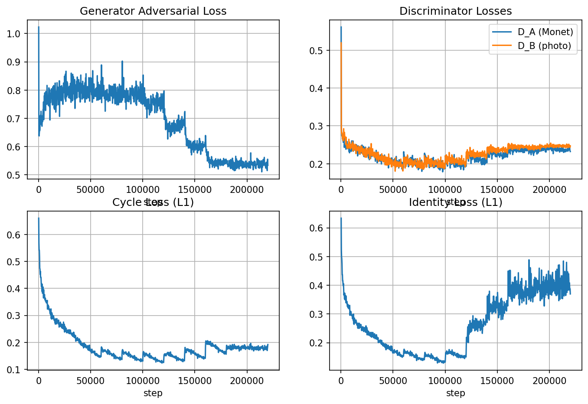
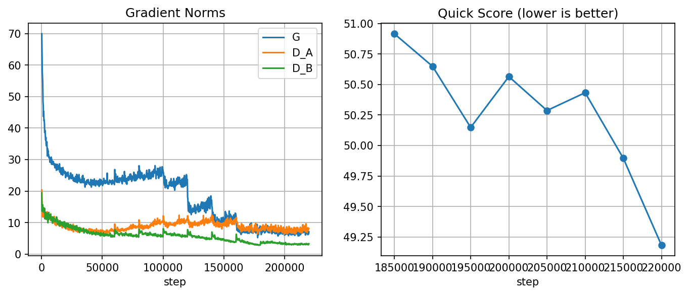
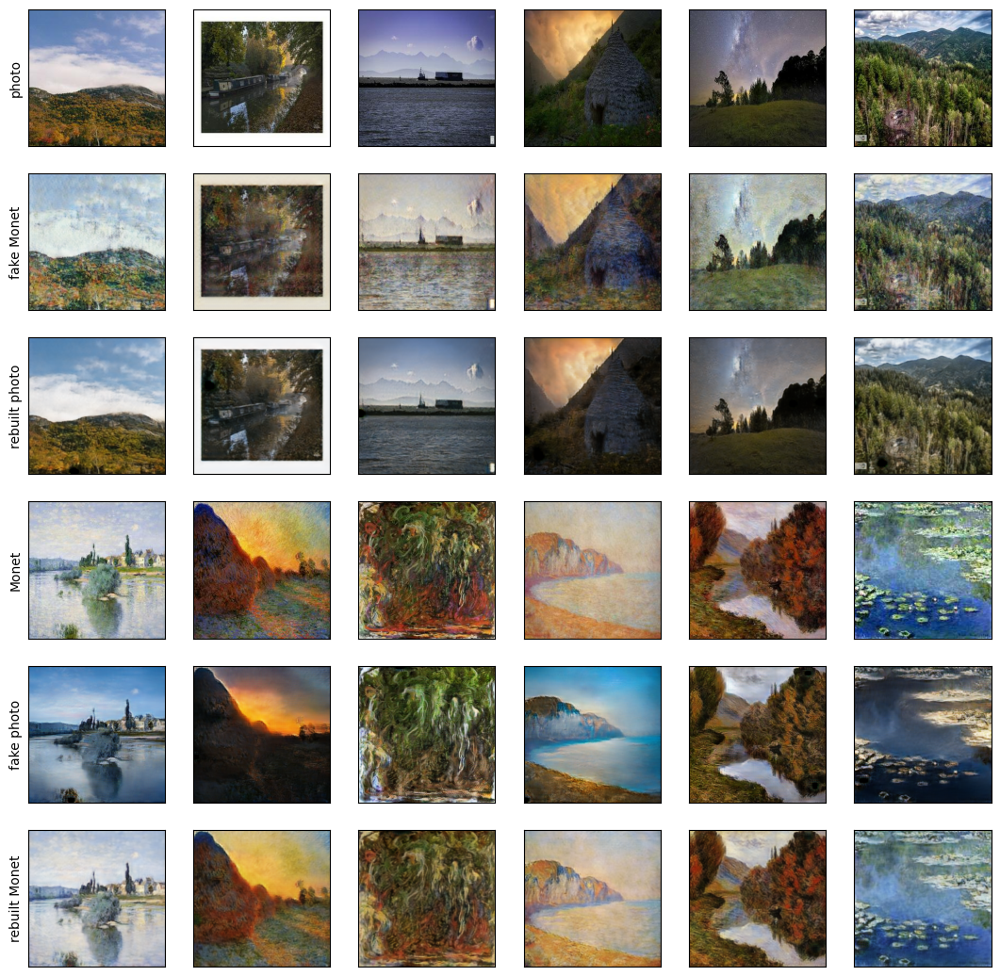

# Task 3 Results: Monet ↔ Photo CycleGAN

## 1. Goal and Data

**Goal:** translate photos into Monet-style paintings and back, without paired examples, using CycleGAN. This is for the Kaggle class competition "DATA 266 Fall 2026 - GAN Image Style Transfer".

**Data:**
- Domain A (Monet paintings): **300 images**
- Domain B (photos): **7,038 images**
- The host confirmed there is no held-out split for this competition — the full 300 and 7,038 images are used for training and also for generating the submission.
- Domain A is much smaller than domain B (about 23x fewer images). The model sees many more real photos than real Monet paintings, which matters for training tricks (see section 3).

## 2. Architecture

- **2 generators**, both `ResNetGenerator`: 9 residual blocks, instance norm, reflection padding. `G_A2B` turns Monet into photo-style, `G_B2A` turns photo into Monet-style.
- **2 discriminators**, both `PatchDiscriminator`, 70x70 PatchGAN (judges local patches of the image as real/fake instead of the whole image at once). `D_A` judges Monet images, `D_B` judges photo images.

| Network | Job | Parameters |
|---|---|---|
| G_A2B | turns Monet into photo | 11,378,179 |
| G_B2A | turns photo into Monet | 11,378,179 |
| D_A | judges Monet images | 2,764,737 |
| D_B | judges photo images | 2,764,737 |
| **Total** | | **28,285,832** |

**Losses used in training:** LSGAN adversarial loss, cycle consistency loss (L1), identity loss (L1). No pretrained network is used in any training loss. Both generators and both discriminators are trained from scratch.

## 3. Training Tricks

| Trick | Reason |
|---|---|
| DiffAugment (color, translation, cutout) | with only 300 real Monet images, the discriminator can otherwise just memorize them instead of learning the real style; differentiable augmentation makes that much harder |
| Image pool (size 50) | discriminator sees a mix of recent fakes, not just the newest one, which keeps training more stable |
| Random crop (286 → 256) + horizontal flip | cheap data augmentation so the model doesn't see the exact same crop/orientation every epoch |
| EMA generators (decay 0.999) | the EMA (slow-moving average) weights are smoother than the raw training weights and give better, less noisy samples |
| Checkpoint chosen by official-method FID/MiFID score | picks the checkpoint that scores best on the same metric Kaggle uses, not just "looks nice" on a few images |

## 4. Training History

The final model is the result of **one single training line**, resumed step by step from checkpoint to checkpoint, plus a few separate side branches that were tried and dropped. The table below shows the main line in order. Every row resumes from the step where the row above it ends, except where marked "fresh run" or "branch off".

| Run | What changed | Steps | Score |
|---|---|---|---|
| Baseline (course reference) | step 112,805, EMA | — | Kaggle **-53.06** |
| 100K run | identity weight 5, cycle weight 10 | 0 → 100,000 | official **-53.92** |
| ft_id1 | identity weight 5 → 1, cycle weight stays 10 | 100,000 → 120,000 | official **-52.94** |
| ft_c5 | cycle weight 10 → 5, identity weight → 0 | 120,000 → 140,000 | official **-52.02** |
| ft_c25 | cycle weight 5 → 2.5 | 140,000 → 160,000 | quick scorer **51.07** |
| ft_c1 | cycle weight 2.5 → 1.0 | 160,000 → 180,000 | quick scorer **50.86** |
| avg5 | average of ft_c25 (160K) + ft_c1 (165K–180K), 5 files | — | official **-50.58** |
| swa_a + swa_a2 | learning rate held constant at 5e-5, no decay | 180,000 → 226,000 | see stage 4 below |
| **final model (swa)** | average of 6 EMA files, 215,000–226,000 | — | official **-49.03** |

Side branches that were tried and dropped, not part of the main line above:

| Run | What changed | Steps | Score |
|---|---|---|---|
| ft_c05 | branch off ft_c25 (160K), cycle weight → 0.5 | 160,000 → 165,000 (stopped) | quick scorer **52.09** — worse than ft_c1, dropped |
| id05_sn | fresh run, spectral-norm discriminator, identity weight 0.5, cycle weight 10 | 0 → 60,000 (stopped) | quick scorer **55.72** — worse, dropped |
| arch2 | fresh run, resize-based upsampling (not transposed convolution), 2-scale discriminator, identity weight 0.5, cycle weight 5 | 0 → 15,000 (stopped by hand) | quick scorer **65.31** — much worse, dropped |

**Sources, one per score:** the official scores (baseline, 100K re-measure, ft_id1, ft_c5, avg5, final model) are each read directly from an `official_submission.csv` file, or in the baseline's case, straight from the matching Kaggle submission entry. The quick-scorer scores for ft_c25 (51.07) and ft_c1 (50.86) are read directly from `outputs/diagnostics.csv`. The quick-scorer scores for ft_c05, id05_sn and arch2 are each read from that run's own `train_log.txt` quick-score line, since those three were never written into `diagnostics.csv`.

**A separate, not-comparable early number:** at the time of the 100K run, before we had the professor's official script, we scored it with our own evaluation code on the full image sets instead of 300 images. That gave a score of about **-44.37** (FID about 88.3). This number is **not comparable** to anything in the tables above and is not an official score — it is kept separate here on purpose. The "100K run" row above uses the official re-measure of that same checkpoint instead.

**Everything else in this report, from here on, uses the professor's official script or a quick scorer built the same way.**

### More detail on stage 1 (0 → 100,000 steps)

Training happened in 3 steps, each picking up from the last checkpoint:

1. 0 → 60,000 steps (first run).
2. 60,000 → 80,000 steps (extended, because the score was still clearly improving).
3. 80,000 → 100,000 steps (extended again, same reason).

Each extension changed the learning-rate schedule to a "smooth restart": the learning rate went back up to about `1e-4`, then decayed to 0 again over the new schedule. This caused a small, temporary bump in the loss curves at step 60,000 and 80,000, which recovered within about 2,000 steps each time.

### Stage 4: constant learning rate and averaging (the final model)

Since averaging the EMA weights of ft_c25 and ft_c1 (the "avg5" row above) helped, the next step was to make more EMA snapshots to average, by training longer at a steady, low learning rate instead of decaying it to zero:

- Resumed from ft_c1 at step 180,000, with the full saved optimizer state.
- Learning rate held **constant at 5e-5** (no decay), run `swa_a`, 180,000 → 220,000 steps.
- Continued as `swa_a2`, same constant 5e-5 learning rate, 220,000 → 226,000 steps, then stopped by hand once the step-226,000 snapshot was saved.
- An EMA snapshot was saved every 2,000 steps (instead of only at the usual checkpoint interval), so there were more snapshots to average from.
- The `swa_a2` run was stopped before its notebook finished, so its own chart files are missing. Its step-by-step record is in `outputs/gpu_swa_a2/train_log.txt`.

Four ranges of EMA snapshots were averaged and scored, each range going from a start step up to the very last saved snapshot (step 226,000):

| Range | Files averaged | Score |
|---|---|---|
| 184,000–226,000 | 22 | 49.48 |
| 200,000–226,000 | 14 | 49.48 |
| 210,000–226,000 | 9 | 49.21 |
| **215,000–226,000** | **6** | **49.04** |

The range with the lowest score, **215,000–226,000 (6 files)**, was kept as the final model.

**Note on how this was chosen:** these four scores were measured with our own quick scorer, which (like the official script) only reads the first 300 sorted photos for its photo-side comparison. The best range was picked using this same fixed set of photos, so this score is a little optimistic. The number we actually report and submitted (section 6) comes from running the professor's full script separately, and it lands very close to this quick-scorer number anyway.

### Resume learning-rate bug

Early on, resuming a run from a saved checkpoint had a bug: the learning rate scheduler would restore the **old** base learning rate (the original peak of 2e-4) instead of the new, lower rate set in that run's config. This was fixed by resetting the scheduler's base learning rate to the config's learning rate right after loading the checkpoint. After the fix, every resume (including the long constant-5e-5 phase) used the correct, intended learning rate from the start. Resuming with the full saved optimizer state (not just the generator weights) kept training stable across every one of these resumes.

## 5. Hardware and Cost

- GPU: NVIDIA GeForce RTX 4090
- Peak memory: about **10,960 MB (about 10.7 GB)**

**Total training time**, computed directly from each lineage run's own `train_log.txt` (the 100K run, ft_id1, ft_c5, ft_c25, ft_c1, swa_a, swa_a2 — each file only holds the steps logged during that one run, so no run is counted twice):

| Run | Step range | Seconds |
|---|---|---|
| gpu (100K run) | 0 → 100,000 | 8,659.7 |
| ft_id1 | 100,000 → 120,000 | 4,011.6 |
| ft_c5 | 120,000 → 140,000 | 4,142.7 |
| ft_c25 | 140,000 → 160,000 | 3,195.6 |
| ft_c1 | 160,000 → 180,000 | 2,535.7 |
| swa_a | 180,000 → 220,000 | 3,805.1 |
| swa_a2 | 220,000 → 226,000 | 998.8 |
| **Total** | 0 → 226,000 | **27,349.3 (about 7.6 hours)** |

Each run's seconds are its own `images/sec` lines turned back into time (400 images ÷ images/sec per logged step, since batch size is 1 and each step moves 2 images, summed over every 200-step interval in that run's own log). The step ranges line up end to end with no gap and no overlap, so the total adds up cleanly.

## 6. Final Metrics (final model: average of 6 EMA checkpoints, steps 215,000–226,000)

Measured with the professor's official script, 300 images per direction:

| Metric | A2B (Monet→photo) | B2A (photo→Monet) | Overall |
|---|---|---|---|
| FID | — | — | 97.6555 |
| MiFID | — | — | 0.41027 |
| Score | — | — | **-49.0330** |

The per-direction FID and MiFID are not split out by the professor's script output. Our own quick scorer, which uses the same method, gives a very close overall score of 49.0358. Extra metrics from the first run (KID, precision/recall, LPIPS, cycle L1) were only computed for the original step-100,000 model and were not re-run for this final averaged model.

## 7. Evaluation Method

Two scripts were used in this project:

- **Our own early script** (`evaluate_local.py`'s older path) computed FID/MiFID on the full image sets with our own Inception setup. This is what gave the stage-1 number of -44.37. This method does **not** match the professor's script and its numbers are **not comparable** to anything else in this report.
- **The professor's official script** (copied path-only into `official_eval_*.ipynb` files, and matched in training by `OfficialQuickScorer`) uses 300 images per direction, the same Inception-v3 setup, and the same FID/MiFID formula as the class uses for grading. **Every score in this report from section 4 onward, and the final result in section 6, uses this method.**

Pretrained models (Inception-v3 for FID, AlexNet for LPIPS) are used **only to measure** the generated images, never to make or alter any image. The training and generation pipeline (`src/models.py`, the training loop) only uses the from-scratch `ResNetGenerator`/`PatchDiscriminator` networks.

## 8. Training Stability

These charts end at step 220,000 because the `swa_a2` notebook was stopped by hand before it could build its own charts, right after saving its step-226,000 EMA snapshot. The charts carry the full training history forward from every earlier stage in one file, so they still cover 0 to 220,000 in one place. The final model goes 6,000 steps further than these charts show — it also uses the checkpoints saved at steps 222,000, 224,000 and 226,000, which are only recorded as text in `outputs/gpu_swa_a2/train_log.txt`.

- **0 NaN losses** across the whole line, from step 0 to 226,000.
- **Discriminators stayed balanced** through every stage, including the long constant-learning-rate phase.
- **The learning-rate restarts** at each new stage (60K, 80K, each fine-tune branch point, and the switch to constant 5e-5) show up as small, temporary bumps in the loss curves, each recovering within a few thousand steps.
- **The quick score kept improving** across almost the whole line, with normal small ups and downs between checkpoints, which is expected noise for GAN scores.

## 9. Cycle Consistency Check

This plot comes from the `swa_a` checkpoint at step 220,000, since the `swa_a2` notebook was stopped by hand before it reached this step and a new plot was not built for the averaged final model (which also uses the checkpoints at steps 222,000, 224,000 and 226,000). It takes photos and Monet paintings, translates each one to the other domain and back, and shows the result. The rebuilt images stay close to the originals, which matches a low cycle loss throughout training.

## 10. Kaggle

- **Submission:** average of EMA checkpoints from the constant-learning-rate continuation, range 215,000–226,000, official eval script
- **Kaggle reference:** 56890592
- **Official score:** FID 97.6555, MiFID 0.41027, score **-49.0330**

## 11. Human Audit (Pending)

A blinded human audit is planned but not done yet:
- **Raters:** 2
- **Images:** 30 pairs, each pair showing the input image next to its translation, side by side, labeled only with a random code name (not "real vs. generated")
- **Agreement metric:** Cohen's weighted kappa

Results: **[PENDING]** — to be filled in after both raters complete `audit_sheet_rater1.csv` and `audit_sheet_rater2.csv`.

## 12. Integrity Statement

All 300 A2B and 7,038 B2A images in the submitted prediction set come directly from the averaged EMA weights described in section 4, stage 4 (`checkpoints/manav_task3_G_A2B.pt` and `G_B2A.pt`, predictions in `outputs/gpu_final_swa`). No image was hand-edited, hand-picked, or swapped in from anywhere else. A full hash check of all 7,338 prediction files found 9 small groups of identical output images (19 files total); in every one of these 9 groups, the **source photos themselves are already byte-identical** in the provided dataset, so the same, deterministic generator correctly produces the same output for them — this is a duplicate already present in the dataset, not duplication introduced by us. Outside of these 9 verified groups, no two prediction images are duplicates. **No pretrained network is used in any training loss.** Both generators and both discriminators were trained entirely from scratch. The only pretrained networks used anywhere in this task are Inception-v3 and AlexNet (LPIPS), and they are used **only to measure results and to find failure cases** after training — never to produce, edit, or alter any image.

## 13. Strengths, Limitations, Future Work

**Strengths**
- Score improved steadily across many stages: -53.92 (100K run, official re-measure) → -52.94 (ft_id1) → -52.02 (ft_c5) → -50.58 (avg5) → -49.03 (final, swa).
- Lowering the cycle weight, then lowering the learning rate and averaging more EMA snapshots, both gave clear, repeatable gains.
- Training was stable across the whole line: 0 NaNs, no gradient explosions, even through a long constant-learning-rate phase.

**Limitations**
- Only 300 Monet images to learn the target style from, versus 7,038 photos — a big class imbalance.
- FID on only 300 real images is naturally noisier than FID computed on a larger set.
- The final range (215,000–226,000) was chosen using the same first-300-sorted-photos set the official script itself reads, so the chosen score is a little optimistic (see section 4, stage 4).
- Some generated images still show color shifts and texture artifacts, especially on dark/night photos, smooth gradients, and fine repeating textures (see `failure_analysis.md`).

**Future Work**
- Try a perceptual or texture-aware loss term to reduce the blotchy artifacts seen on some outputs.
- Try more or different augmentation specifically for the Monet domain, since it is the much smaller set.
- Try a color-consistency loss (comparing color histograms between input and output) to reduce color shifts on unusual input colors.
- Run the human audit (section 11) and compare the kappa agreement against the automatic metrics.
- Resize-based upsampling and a 2-scale discriminator were already tried (the `arch2` branch) and did not help, so this is not listed as future work again.
